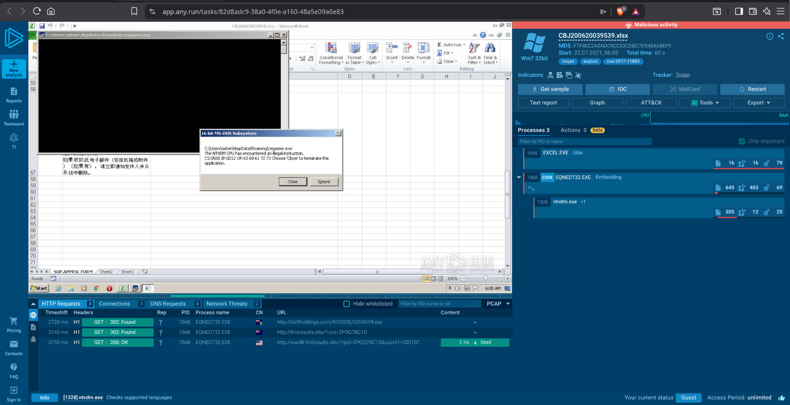
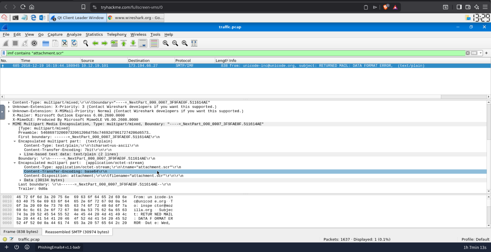
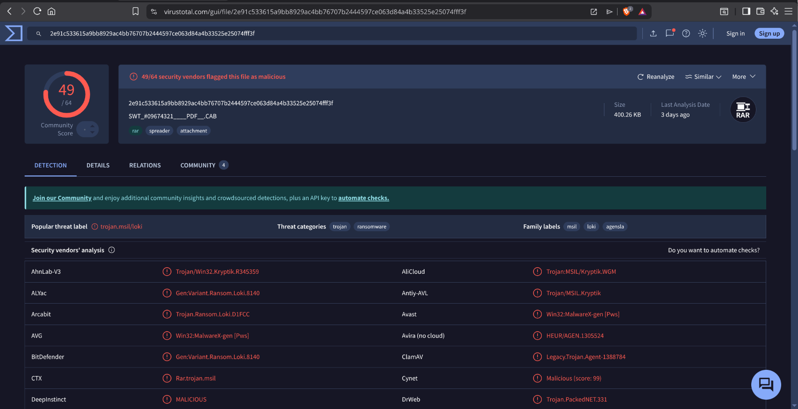
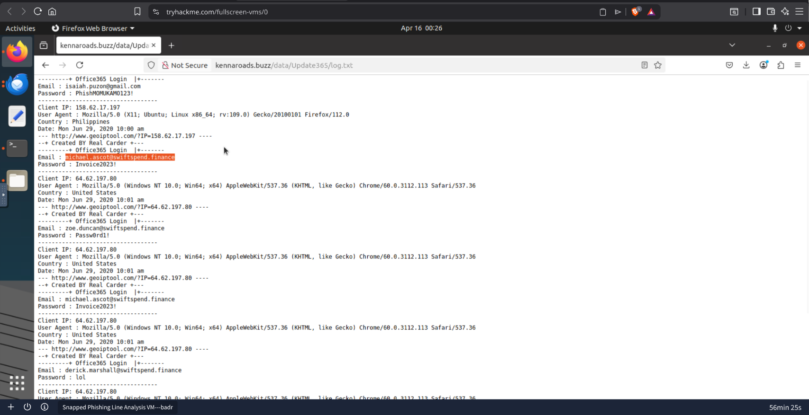

# 01 — Phishing Analysis

Practical phishing analysis work completed across four TryHackMe rooms.
Labs cover the full phishing triage workflow — from raw email header
analysis through to sandbox detonation, attachment investigation, and full attack
chain reconstruction.

Each lab builds on the previous — starting with static header analysis, moving into
dynamic sandbox detonation, and finishing with a full credential harvesting
investigation requiring CyberChef decoding and SHA256 verification.

**Tools used:** Wireshark, any.run, VirusTotal, MXToolbox, CyberChef, exiftool, sha256sum

---

## Labs

### THM Phishing Emails 3

Static and dynamic analysis of malicious email attachments. Introduces any.run as a
sandbox environment for safely detonating suspicious files, and covers identification
of CVE-2017-11882 — a Microsoft Equation Editor RCE vulnerability commonly exploited
in phishing campaigns. Both a malicious PDF and XLSX payload are investigated, with
network connections, process trees, and static metadata all examined as part of the
triage process.

*any.run sandbox detonation confirming CVE-2017-11882 exploitation via the malicious XLSX attachment*

---

### THM Phishing Emails 4

Wireshark-based email analysis using SMTP and IMF display filters. Moves away from
sandbox detonation and into live packet capture analysis — reconstructing an email
session directly from a PCAP file. Covers identification of a Spamhaus reputation
block, a 552 content rejection response from the mail server, and extraction of a
malicious .scr attachment embedded in the email stream using the IMF filter.

*Wireshark IMF filter — .scr attachment identified within the email body, a common executable masquerading technique*

---

### THM Greenholt Fish CTF

End-to-end phishing triage CTF based on a fake SWIFT bank transfer notification.
Covers raw header analysis, sender IP WHOIS lookup, SPF and DMARC record verification
via MXToolbox, attachment SHA256 hashing, and VirusTotal submission. The attachment
is identified as a malicious .cab file with RAR metadata, returning 49/64 detections
on VirusTotal with Loki flagging it as malicious.

*VirusTotal results — 49/64 vendor detections on the .cab attachment, Loki detection confirmed*

---

### THM Snapped Phish-ing Line

Full attack chain reconstruction from an active credential harvesting campaign.
Starting with a suspicious executable, the investigation works outward — enumerating
an exposed phishing server, recovering harvested credentials from a server-side log
file and decoding a hidden flag via CyberChef base64 decode. Covers VirusTotal analysis, open directory
enumeration, grep-based HTML source analysis, and SHA256 verification.

*log.txt recovered from the phishing server — plaintext harvested credentials confirming active credential theft*