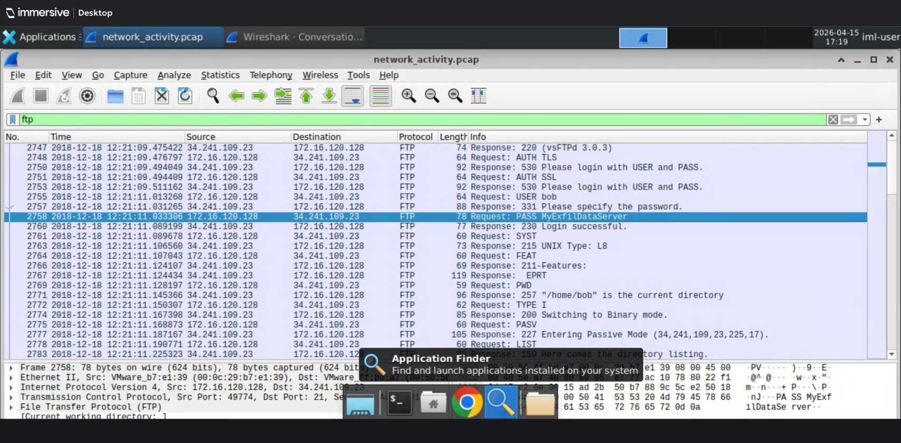

# 02 — Incident Response

Practical incident response lab completed on Immersive Labs.
Focuses on identifying and investigating a data exfiltration incident across multiple
protocols — moving from SMB2 file access enumeration through to full FTP session
reconstruction and plaintext credential recovery from packet capture.

**Tools used:** Wireshark, SMB2 protocol analysis, FTP session reconstruction

---

## Labs

### IL Incident Response: Data Exfiltration

Investigation of a data exfiltration incident involving SMB2 file access and FTP
credential theft. The scenario requires identifying the Samba server IP, enumerating
CSV files accessed over SMB2, reconstructing the full FTP session to identify the
external exfiltration server, and recovering the attacker's plaintext username and
password directly from the FTP stream. Demonstrates the practical application of
Wireshark protocol filters in an IR context.

*Wireshark — FTP PASS command visible in plaintext, credentials recovered directly from the packet stream*