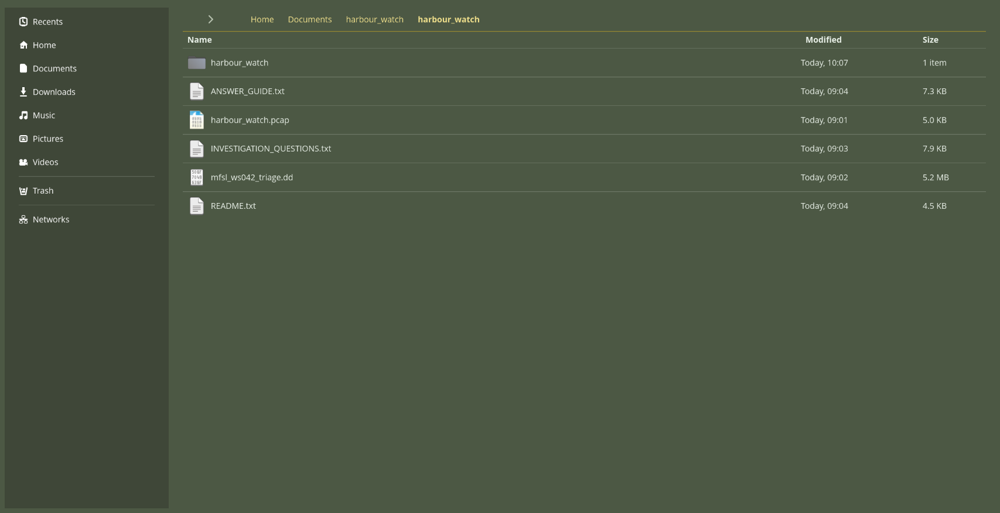
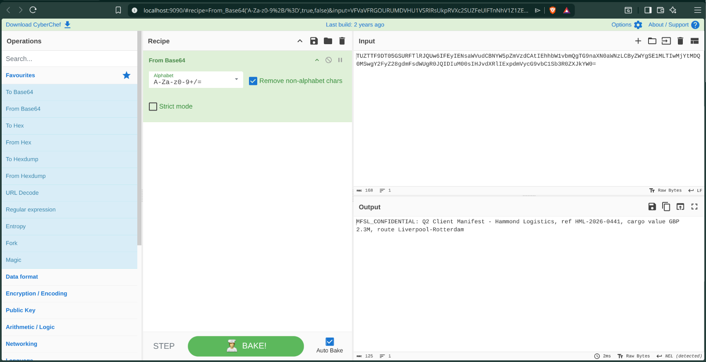
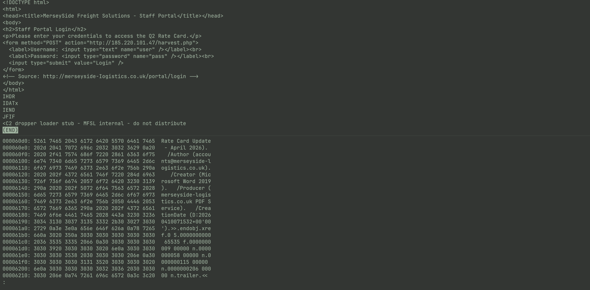

# 03 — Mock Investigation

A self-contained incident response scenario built from scratch as a BTL1 exam simulation. Operation Harbour Watch combines network forensics
and disk image analysis into a single cohesive investigation — mirroring the style
and difficulty of a real BTL1 exam scenario.

The scenario centres on a suspected compromise at a fictional logistics company,
MerseySide Freight Solutions Ltd. An employee opened a malicious email attachment,
triggering a C2 beacon and data exfiltration event. The investigation requires
working across both a PCAP file and a raw disk image to reconstruct the full
attack chain.

**Built using:** Claude AI (scenario design, PCAP generation, disk image construction)
The scenario and all evidence files were purpose-built using Claude AI as a
development tool — generating a realistic PCAP with genuine C2 beacon patterns,
jitter, and base64-encoded exfiltration, alongside a raw disk image containing
carved artefacts with correct magic bytes and embedded metadata.
**Tools used:** Wireshark, CyberChef, binwalk, dd, exiftool, pdfinfo, strings
**Score:** 28/40 — Silver
---

## Operation Harbour Watch

### Setup

The evidence package contains a PCAP file capturing 12 hours of perimeter traffic
from the compromised workstation subnet, and a 5MB raw disk image collected via
triage. The scenario briefing provides the incident context, network diagram, and
18 investigation questions spanning PCAP analysis, disk forensics, and a synthesis
section requiring a written escalation summary.

*Evidence package contents — PCAP, disk image, scenario briefing, question sheet, and answer guide*

---

### PCAP Analysis

Network analysis of the harbour_watch.pcap file. Tasks include filtering out
legitimate baseline traffic, identifying the C2 server via DNS and IPv4 conversation
analysis, detecting a deliberate User-Agent anomaly embedded in the beacon traffic,
and decoding a base64-encoded HTTP POST payload containing the exfiltrated data.
The beacon pattern runs at approximately 60-second intervals with jitter, requiring
relative timestamp analysis to confirm the interval.

*CyberChef — base64-encoded HTTP POST payload decoded, revealing the exfiltrated shipment manifest*

---

### Disk Forensics

Analysis of the mfsl_ws042_triage.dd disk image. Binwalk is used to identify
embedded file signatures, followed by targeted dd extraction of artefacts including
JPEG files with EXIF metadata, a PDF with phishing author metadata, a cached HTML
credential harvesting page, and a disguised executable with a .dat extension.
pdfinfo and strings are used to extract metadata and identify the typosquatted
phishing domain embedded in the PDF author field.

*strings output — credential harvester C2 stub URL recovered from the cached HTML phishing page*