# 04 — Network Analysis

Wireshark and network analysis labs completed on Immersive Labs containing a Crest Accredited lab.
Covers a broad range of network analysis skills across ten labs — from
foundational display filter construction through to TLS handshake inspection, stream
extraction, BPF syntax, and a full demonstrate-your-skills assessment.

The labs progress in difficulty, building from basic protocol filtering into more
advanced techniques including TLS traffic decryption, SMB/FTP/HTTP object extraction,
and compound filter construction for targeted packet capture.

**Tools used:** Wireshark, tcpdump, CyberChef

---

## Labs

### Display Filters

Introduction to Wireshark display filter syntax. Covers filtering by protocol,
source IP, host IP, and port number — building the foundation for all subsequent
packet analysis work. Filters are applied to a mixed-traffic PCAP to isolate
specific conversation types and reduce noise during investigation.

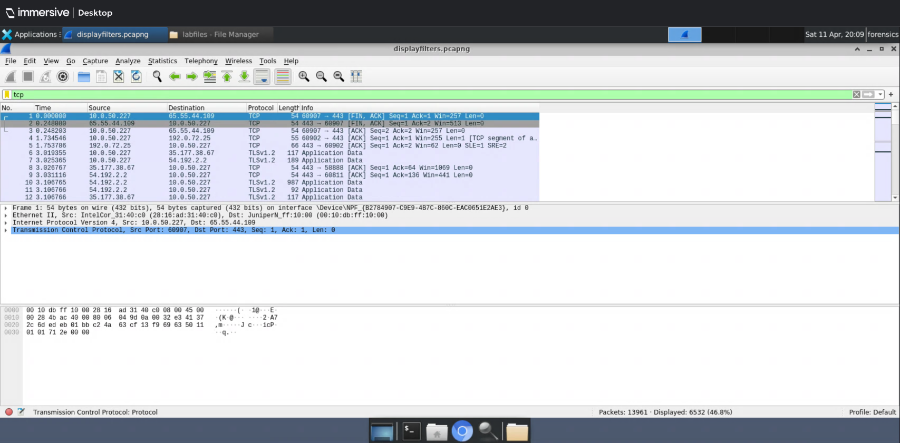
*Wireshark display filter bar — tcp filter applied, reducing 13,961 packets to 6,532 displayed*

---

### SMTP Analysis

Protocol-level analysis of SMTP traffic using Wireshark display filters and string
matching. Covers filtering for email subjects, recipient domains, and DNS source
ports to map mail server infrastructure. Demonstrates how plaintext SMTP sessions
expose email metadata and routing information directly in packet capture.

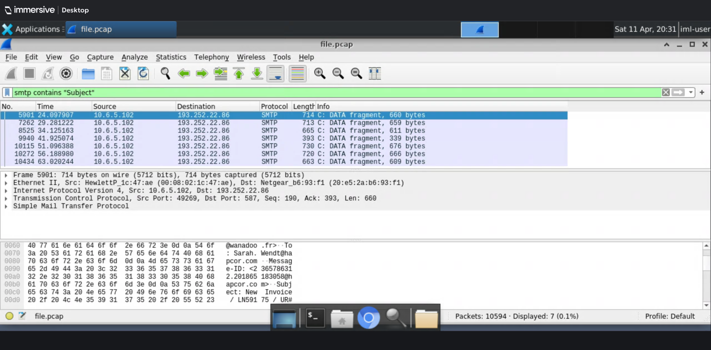
*Wireshark — smtp contains "Subject" filter isolating email DATA fragments across the capture*

---

### Network Investigation

Advanced compound filter construction combining protocol, port, and IP conditions.
Covers filtering for HTTP requests and TLS Client Hello packets simultaneously,
excluding specific ports from results, and isolating individual UDP conversations.
Builds the analytical skills needed to triage mixed-protocol captures efficiently.

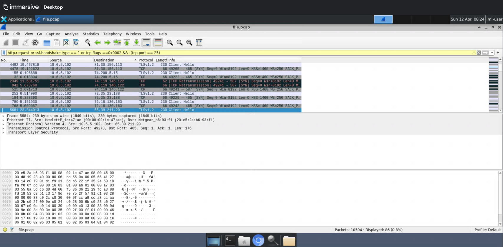
*Wireshark — compound filter combining HTTP requests and TLS Client Hello, excluding port 25*

---

### Wireshark Statistics

Using Wireshark's built-in statistics tools for rapid traffic profiling. Covers
the Endpoints and Conversations windows for IPv4 traffic mapping, and the Resolved
Addresses feature for hostname-to-IP correlation. Demonstrates how statistics views
accelerate the initial triage phase of a network investigation.

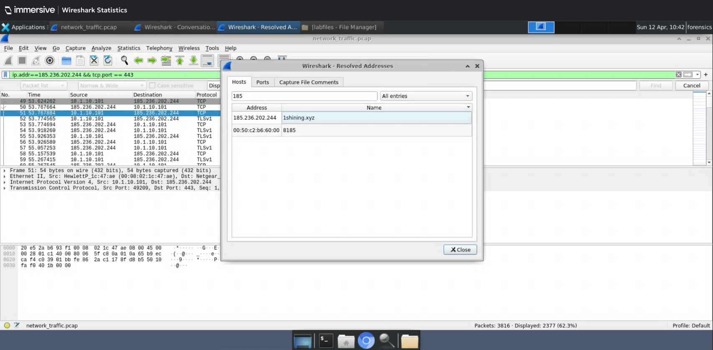
*Wireshark Resolved Addresses — 185.236.202.244 resolves to 1shining.xyz, identifying suspicious infrastructure*

---

### TCPDump

Command-line packet capture and analysis using tcpdump. Covers listing available
interfaces, reading from an existing PCAP file, applying host-based BPF filters,
and piping output through grep for targeted string matching. Demonstrates tcpdump
as a lightweight alternative to Wireshark for headless and remote analysis.

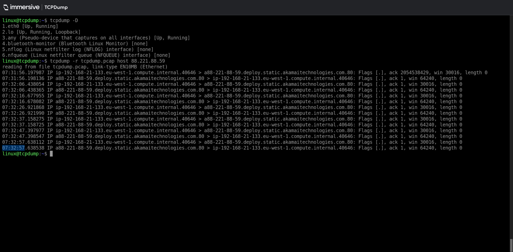
*tcpdump — interface listing and host-filtered PCAP read, Akamai CDN traffic isolated*

---

### BPF Syntax

Berkeley Packet Filter syntax for tcpdump. Covers constructing src host and port
filters, combining conditions with and/or operators, piping output through grep,
writing filtered output to a new PCAP file, and verifying the output with md5sum.
BPF filtering is an essential skill for scoping captures in live IR scenarios.

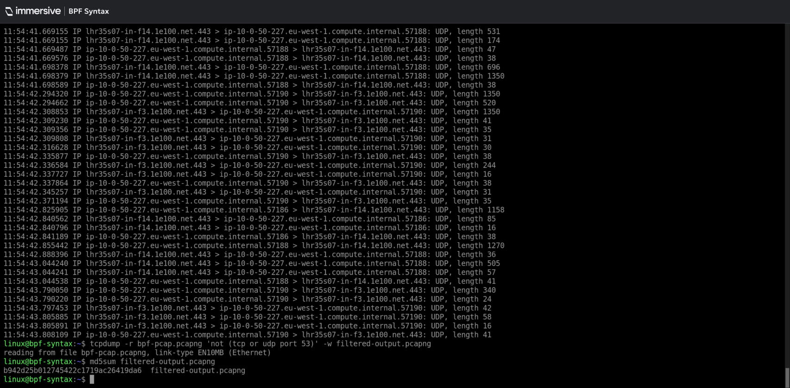
*tcpdump BPF — not tcp/udp port 53 filter applied, filtered output written to PCAP and md5sum verified*

---

### TLS Handshake

Deep inspection of the TLS handshake process using Wireshark. Covers identifying
TLS version, cipher suite negotiation, Client Hello and Server Hello random values,
and supported cipher suite enumeration. Understanding the TLS handshake is
foundational for both network analysis and TLS decryption work.

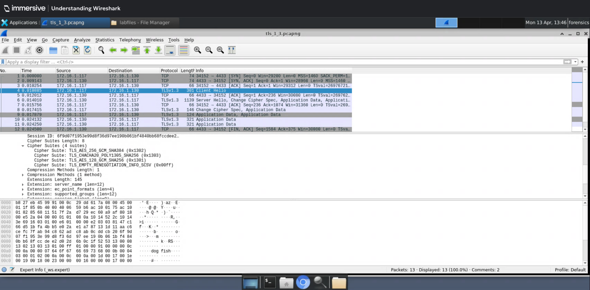
*Wireshark — TLS 1.3 Client Hello expanded, four supported cipher suites visible in the handshake*

---

### TLS Traffic Decryption

Decrypting TLS-encrypted traffic in Wireshark using a pre-master secret key log
file. Covers applying the key log to a PCAP, filtering decrypted HTTP streams,
following TCP streams to recover plaintext content, and identifying files transferred
over what appeared to be encrypted sessions. Demonstrates a critical IR technique
for investigating encrypted C2 and exfiltration traffic.

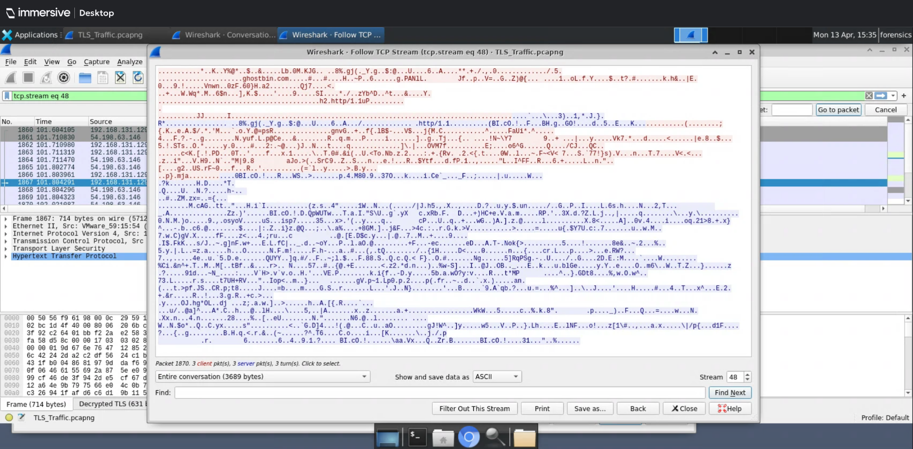
*Wireshark Follow TCP Stream — TLS decrypted, Ghostbin paste content recovered in plaintext*

---

### Stream and Object Extraction

Extracting files and data from packet captures using Wireshark's export features.
Covers HTTP object export, SMB object export for recovering documents transferred
over network shares, FTP data stream filtering, and manual file reconstruction
from reassembled TCP streams. Includes MD5 hash verification of extracted files
and unzipping a .docx to grep for hidden flags in the XML content.

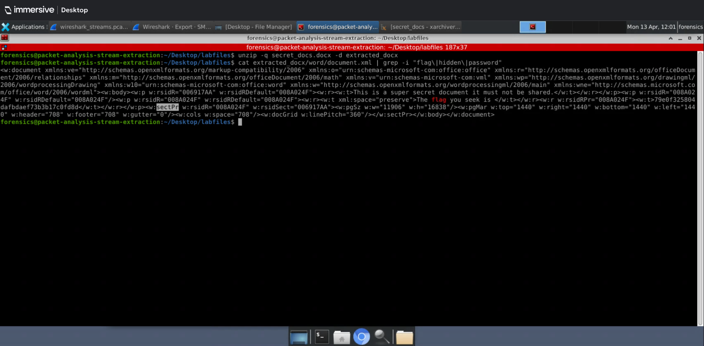
*Terminal — secret_docs.docx unzipped and grepped for flag string, hidden content recovered from XML*

---

### Packet Capture Basics

Foundational packet capture analysis using a mixed-protocol PCAP. Covers DNS query
and response analysis, HTTP GET request inspection, TCP stream following, HTTP
object export and image recovery, and IPv4 conversation enumeration. Includes
identification of the web server engine from response headers and extraction of
embedded images from HTTP traffic.

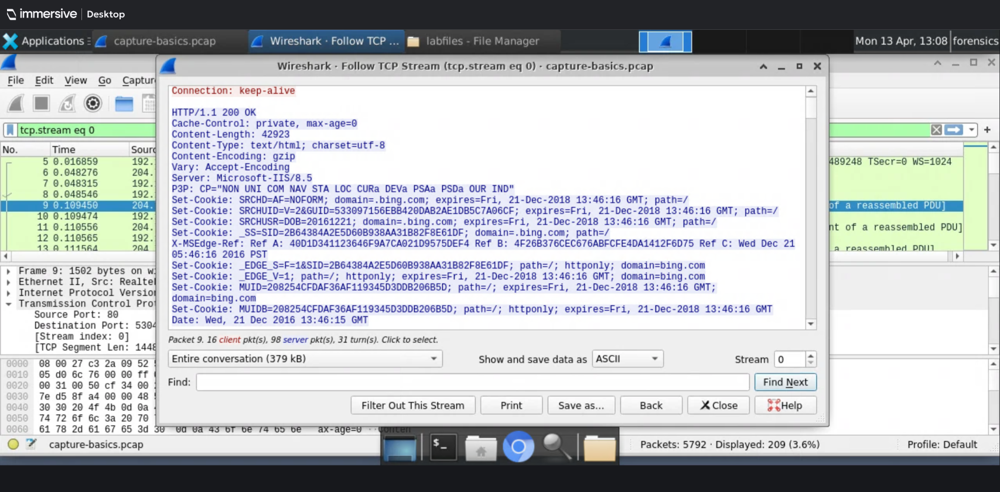
*Wireshark Follow TCP Stream — HTTP response headers revealing Microsoft-IIS/8.5 as the web server*

---

### Demonstrate Your Skills

An assessment lab applying the full range of Wireshark skills
covered across the series. Tasks include identifying an exfiltration server from
HTTP upload traffic, determining the number of files attempted, calculating beacon
wait times from relative timestamps, identifying file size limits from multipart
POST data, and extracting HTTP boundary strings from chunked uploads.

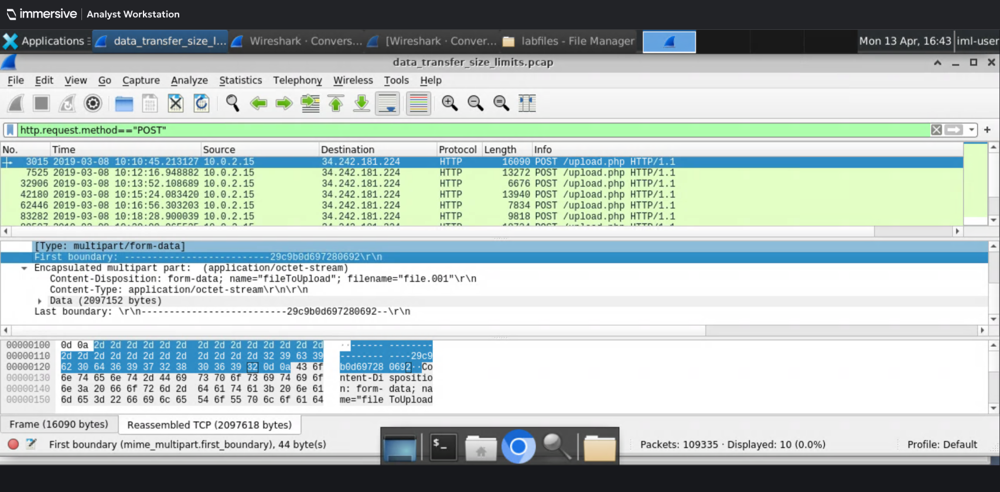
*Wireshark — HTTP POST multipart boundary string identified in chunked upload stream*