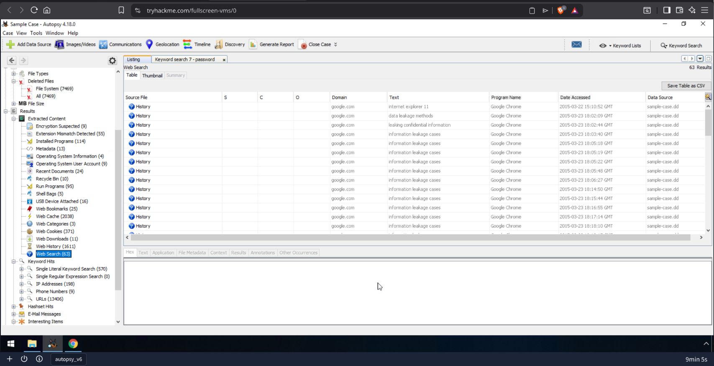
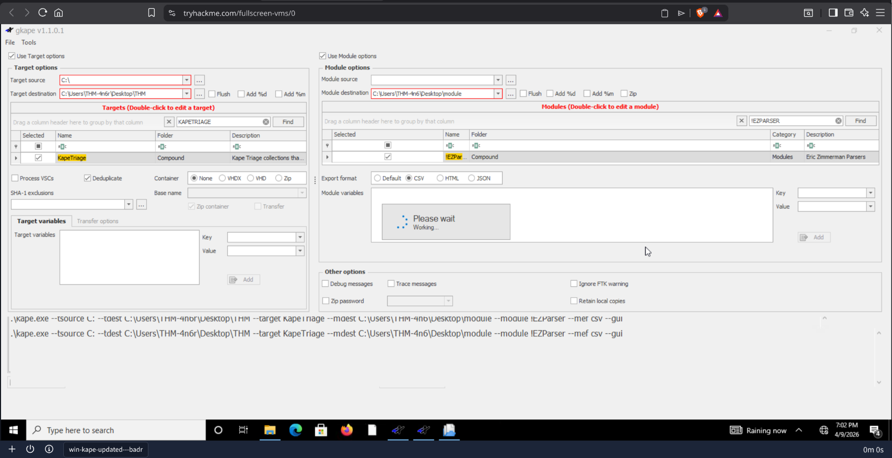

# 05 — Digital Forensics

Digital forensics labs completed across three TryHackMe rooms. 
Covers the core forensic toolkit expected in BTL1 — disk image triage with
Autopsy, rapid artefact collection with KAPE, and manual and automated file carving
across a range of file types and scenarios.

Labs progress from high-level GUI-based investigation through to low-level manual
carving using hex editors and command-line tools, building a solid foundation across
the full digital forensics workflow.

**Tools used:** Autopsy, KAPE, gkape, EZViewer, binwalk, foremost, scalpel, exiftool,
Okteta, dd, strings, pdftotext

---

## Labs

### THM Autopsy

End-to-end disk image investigation using Autopsy. The lab uses a sample case
image to work through the full Autopsy workflow — loading a data source, running
ingest modules, and using the results tree to triage extracted artefacts. Covers
operating system identification, user account enumeration, deleted file recovery,
cloud storage artefact analysis, keyword searching, web history and search term
extraction, and HTML report generation. The investigation reveals evidence of
deliberate data exfiltration and anti-forensic tool usage by the suspect.

*Autopsy web search artefacts — "information leakage cases" identified as the most searched term,
indicating deliberate research into data exfiltration methods*

---

### THM KAPE

Rapid triage collection and processing using KAPE and gkape. Covers the distinction
between Targets and Modules, running the KapeTriage Compound Target against a live
system, processing collected artefacts with the !EZParser module, and reviewing
output in EZViewer. Also covers USB device history recovery from the USBSTOR
registry key — identifying a Kingston DataTraveler and an external USB device
connected to the system under investigation.

*gkape — KapeTriage collection running with !EZParser module processing, CSV output selected*

---

### THM File Carving

Manual and automated file carving across three progressively difficult challenges.
Covers identifying file headers and footers using Okteta hex editor, extracting
files manually with dd, and automating recovery using foremost and scalpel. Also
covers binwalk for embedded file signature detection, exiftool for metadata
extraction and hidden flag recovery, and pdftotext for extracting content from
carved PDF files. The capstone challenge involves a full disk image containing
an EXT filesystem, a PNG, an SVG disguised as XML, a WAV audio file, and a hidden
flag embedded in image metadata.

*THM File Carving capstone — all four questions answered correctly, covering XML offsets,
file type identification, audio duration, and hidden image flag*